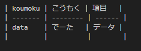

# vscode plugin
vscode plugin と導入に当たって気を付けることをまとめるページ

## plugin一覧
| プラグイン                | 概要                                   | 備考                                           |
| ------------------------- | -------------------------------------- | ---------------------------------------------- |
| SSH Remote                | SSHクライアント                        |                                                |
| Draw.io Integration       | Draw.ioの作成                          | name.dio.pngの空ファイル作成からすぐに利用可能 |
| Markdown Preview Enhanced | markdownのプレビューとword形式等の出力 | 他プレビュー系プラグインとの共存での設定に注意 |
| Marp                      | markdownからパワポ出力                 |                                                |
| Markdown Table            | markdownでのテーブル記述サポート       | 全角:半角=2:1の等幅フォントで出ない場合崩れる  |

## Draw.io Integration のテーマ変更
darkだと使いにくい場合があるので、kennedyあたりに変更すると良い。  
File -> Preferences -> Settings ->  Search Settings -> hediet draw.io thema

## Markdown Preview Enhanced 他プレビューを共存させる場合の注意
Markdown Preview Enhanced が標準のプレビュー（Marpプレビューなど）をデフォルトで非表示にするので、表示するようにすると良い。
```json
{
  "markdown-preview-enhanced.hideDefaultVSCodeMarkdownPreviewButtons": false,
}
```

## Markdown Table での vscode font 変更



- windowsのvscodeにおいてデフォルトフォントのConsolasがテーブル記述に使いやすい等幅フォント（全角：半角 が ２：１）ではないためレイアウトが崩れる場合がある。
    - linuxだとデフォルトフォントのDroid Sans Monoが２：１フォントのようなのでレイアウト崩れに困らない
- vscodeの設定から全角：半角 が ２：１の等幅フォントを切り替えるとよい
    - File -> Preferences -> Settings ->  Search Settings -> editor.fontFamily
    - 簡単なのは 'MS Gothic' の追加
    - 好きなフォントがあれば適宜インストール
    - [PlemolJP Console NF](https://tamapoco.com/archives/9017)あたりがよさそう
    - フォントインストール後はvscodeの再起動が必要なことに注意