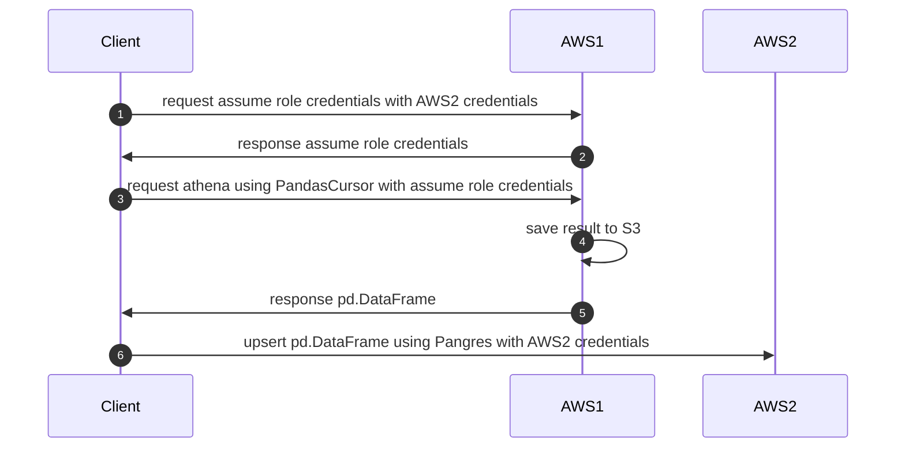

# AWS利用メモ
コンソールメモ  
URLは東京リージョン想定

## IAM
### IAM払い出し
IAM > ユーザー から  
新規IAMの初期利用情報はcsvに書き出せる  
https://us-east-1.console.aws.amazon.com/iamv2/home?region=ap-northeast-1#/users

### IAMパスワードポリシー
IAM > アカウント設定 から  
編集と確認が可能  
https://us-east-1.console.aws.amazon.com/iamv2/home?region=ap-northeast-1#/account_settings

## AthenaのデータをRDSに保存する
AWS1上のS3データにPyAthena経由でpd.DataFrame形式でデータを取得し、別のAWS2のRDSにPangresを用いてpostgresqlにupsertする流れ。
ただし、AWS2のIAMを用いてAWS1に対してAssumeRoleできるものとする。
AWS1からのデータ取得はAsyncPandasCursorの方がデータ量によっては早いと思われる。

### 主に利用するライブラリ
- boto3.Session().client('sts').assume_role
- pyathena.pandas.cursor.PandasCursor
    - pyathena.pandas.async_cursor.AsyncPandasCursor
- pangres.upsert

### 流れ

### 参考
- [PyAthenaの速度を改善する方法](https://qiita.com/katsulang/items/cc388fa4da031dc249bf#-pyathenapandascursor)
- [DataframeをそのままPostgresにUPSERTできちゃうPangres](https://shimacotrip.com/dataframe%E3%82%92%E3%81%9D%E3%81%AE%E3%81%BE%E3%81%BEpostgres%E3%81%ABupsert%E3%81%A7%E3%81%8D%E3%81%A1%E3%82%83%E3%81%86pangres/)

## メモ
- [Route53のAレコードで所有していないEIP、パブリックIPが設定されていないか「Ghostbuster」を使って把握してみた](https://dev.classmethod.jp/articles/route53-ghostbuster/)
- [Amazon Aurora のローカルストレージについて調べてみた](https://link-and-motivation.hatenablog.com/entry/2022/09/12/120545)
- [Lambdaにコンテナ形式でデプロイしてみた](https://blog.denet.co.jp/deployed-to-lambda-in-containerized-form)
- [AWS Lambda 関数を Docker コンテナを使ってビルド & デプロイ](https://qiita.com/sasaco/items/b65ce36c05c50a74ac3e)